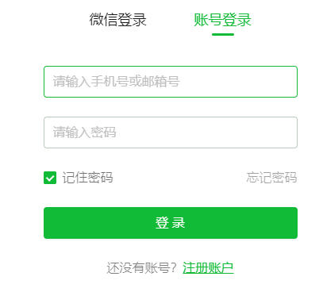
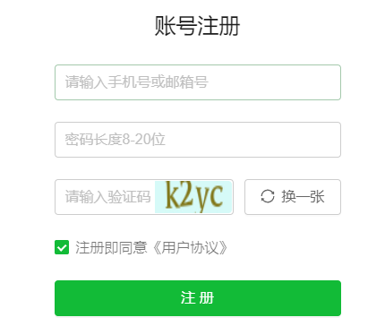
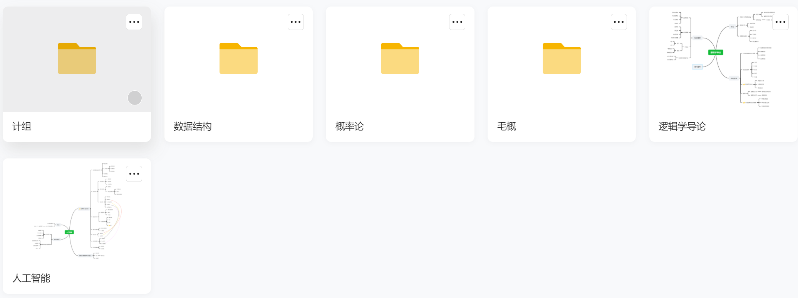
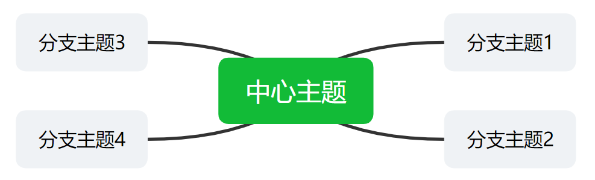

# Mind Map 项目总体设计与架构

## 1. 总体目标

完成一款可以在网页端进行编辑创作的思维导图工具，并且可以将需要保存的思维导图文件存储到服务器端。可以对每个人分配账号然后根据账号通过数据库关联到服务器端的文件目录和具体文件。

## 2. 前端设计

### 2.1 登录功能和相关页面

用户可以在登录页面进行登录，如果没有注册过账号的话可以跳转到注册页面完成注册再继续登录。在注册页面用户可以申请账号和密码，如果申请成功可以将账户信息上传到服务器端。

#### 2.1.1 登录和账号申请时的判断功能

最简单的实现方式就是在客户端向服务器请求账号数据，然后进行判断，但这样会出现信息泄露的问题，所以直接舍弃。

另外就是在判断的时候将用户申请的账号上传到服务器，在服务器进行判断在判断完成后向客户端返回结果。这种方法可以减少数据传输的流量并确保了安全性。

#### 2.1.2 登录界面的UI设计

#### 2.1.3 注册页面的UI设计

### 2.2 文件管理功能和相关页面

#### 2.2.1 文件显示功能

用户在登录后客户端自动向服务器申请文件目录，客户端获得服务器得到的文件目录后，可以根据目录生成文件夹和文件图标，并且页面默认展示根目录。

#### 2.2.2 文件的增删功能

客户端提供文件和文件夹的删除和新建功能，当用户使用这两个功能时删除一个已经显示的图标，或者新建一个新的图标，此外客户端向服务器发送更新信息，在服务器同步目录。

#### 2.2.3 文件的编辑功能

当点击文件夹图标后，显示该文件夹下的文件夹和文件。当点击文件后将会跳转到文件编辑页面，在此页面可以进行思维导图的编辑。

### 2.3 思维导图的绘制

当新建并打开一个新思维导图文件时，应该跳转到思维导图的初始页面：

其中每个主题都可以向下迭代子主题，除根主题之外每个主题都可以生成同层主题。
每个主题都可以更改文本风格（如：字体样式、大小、加粗、斜体）和主题风格（颜色、透明度）。
此外用户可以通过鼠标拖动来更改主题的位置和结构，如将子主题放到同等主题。

### 2.4 思维导图文件的保存

当用户执行保存操作时，客户端可以根据当前创作的结构和各个主题的风格来生成JSON文件并将文件更新到服务器端。

## 3. 服务器端设计

